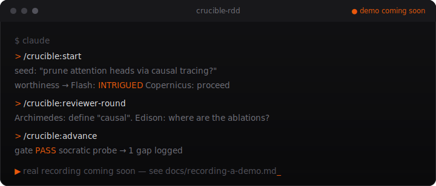

<div align="center">


<p>
  <em>Forge your research in fire. Run every stage through a panel of adversarial reviewers —<br>
  you don't advance until the work survives them.</em>
</p>

<p>
  <a href="https://github.com/vasanthsarathy/crucible/actions/workflows/ci.yml"></a>
  <a href="LICENSE"></a>
  
  
  
  
</p>

<br>



<sub><a href="docs/recording-a-demo.md">▶ placeholder — how the real demo GIF gets recorded</a></sub>

</div>

---

A Claude Code **plugin marketplace** for Review-Driven Development (RDD) of AI/ML
research. The idea: treat reviewers like tests. Run your work through a panel of
adversarial personas at every stage, the same way TDD runs code through tests —
and don't move on until they pass it *and* you can explain it back without looking
at the draft.

Add the marketplace once, then install whichever plugins you want.

## 📦 Install

```text
/plugin marketplace add vasanthsarathy/crucible
/plugin install crucible-rdd@crucible
```

Then `/reload-plugins` (or restart Claude Code) to activate.

## 🧩 Plugins

| Plugin | What it does |
| :-- | :-- |
| 🔥 [**`crucible-rdd`**](plugins/crucible-rdd/) | Run your research through an adversarial reviewer panel at every stage. Skills-primary — works standalone, enriched by an optional MCP server. |

> _More plugins on the way._ &nbsp;🛰️ A companion plugin is planned and will slot in as a new entry here.

## 🔬 What `crucible-rdd` gives you

<table>
<tr>
<td width="50%" valign="top">

**🚦 Staged gates**

```text
SEED → PROBLEM → SURVEY →
SOLUTION → DEVELOP → PAPER
```

Each gate must be passed by the reviewer panel before you advance — no skipping ahead.

</td>
<td width="50%" valign="top">

**🎭 Nine reviewer personas**

Flash · Archimedes · Edison · Copernicus · Orwell · Linnaeus · Socrates, plus **Cicero** (the champion, arguing the strongest case for the work) and **Rawls** (ethics and societal impact) — each with a fixed lens and a default stance built to resist sycophancy.

</td>
</tr>
<tr>
<td valign="top">

**🧠 Socratic probes**

After each gate you answer 2–3 open questions from memory. The stage doesn't advance until you genuinely understand your own work.

</td>
<td valign="top">

**🗂️ Plain-file state**

Everything lives in `.crucible/` as Markdown + JSON. Version-controllable, no server required. The optional MCP server adds live arXiv / Semantic Scholar search.

</td>
</tr>
</table>

➡️ Full details, skill reference, and venue profiles in the
[**plugin README**](plugins/crucible-rdd/README.md).

## 🔬 In practice

You start with a rough hunch. Crucible gut-checks whether it's worth pursuing, then
walks you stage by stage — and at each one a panel of nine adversarial reviewers
(plus a Devil's Advocate pass and a Socratic probe) tries to stop you. You advance
only when the work survives *and* you can explain it back from memory. Just ask
*"how would reviewers react?"* and the panel weighs in; you cross a gate only when
you choose to.

➡️ **[Read the full seed-to-first-gate walkthrough →](plugins/crucible-rdd/README.md#-a-walkthrough)**

## 🔄 Updating

Plugin updates ship as version bumps in each plugin's `plugin.json`. To pull the latest:

```text
/plugin marketplace update crucible
```

## 📚 Documentation

Deeper docs live in [`docs/`](docs/) — [architecture](docs/architecture.md) and a
[per-skill reference](docs/README.md). Contributing? See [CONTRIBUTING.md](CONTRIBUTING.md).

## 🗂️ Repository layout

```text
crucible/                         ← this marketplace
├── .claude-plugin/
│   └── marketplace.json          ← catalog of plugins
├── .github/                      ← CI, issue/PR templates
├── assets/                       ← logo + demo
├── docs/                         ← architecture + per-skill reference
├── scripts/
│   └── bump-version.sh           ← release helper
└── plugins/
    └── crucible-rdd/             ← the RDD plugin (its own README, skills, MCP server)
```

## 📄 License

[MIT](LICENSE) © vasanthsarathy

<div align="center">
<sub>🔥 Built for researchers who'd rather get rejected by a robot first.</sub>
</div>
